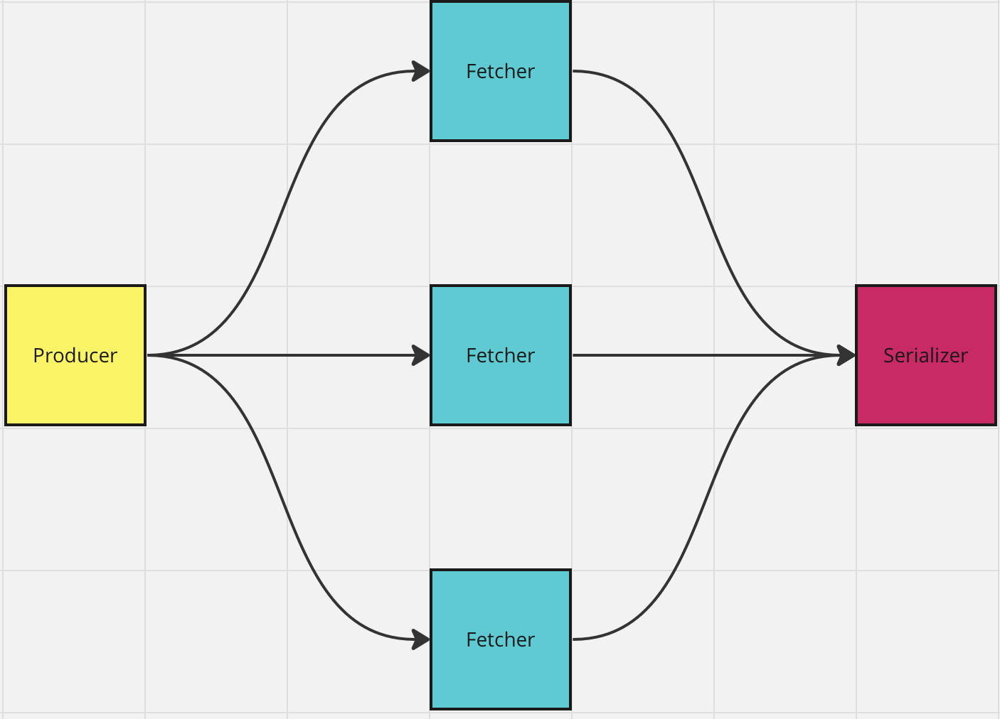

# Ravi Patel Data Pipeline

Problem: There are various data providers which have apis which we are gathering updates from. The formats are different per provider and sometimes there can be duplicate items. 

Objective: The goal here is to show a high level way that we can attack this problem. There are many performance considerations that we can think about and we will cover some of those later.

Running the application:

- Install docker compose
- Run `docker compose up --build`
- Verify in logs that you see `fetcher` and `mongodb` in logs

Structure of initial solution:

Steps here:

1. Pre-load links into Mongodb with information around type and last_checked date (defaulted to 1970). Create collection for host data with indices for hostname and external_ip to ensure duplicates can’t be inserted.
2. Producer will pull links not parsed in the last hour, and populate a queue for the fetchers, and update the checked time. This is all done in transaction to ensure that in the case where there are more than one producers, they can’t modify the data while it is being processed. Payloads will be the source type, various links, and parameters needed such as ‘skip’ for pagination.  
3. Fetchers will pull link payload from the fetcher queue to gather the information needed from the apis and populate the serializer queue.
4. Serializer will pull json payloads from the serializer queue. Then standardize the format using the ‘Model’ class. Next, check the database for previous information regarding host in which case the data will be checked if it is exactly the same or if there is new information provided which needs to be saved.

General Notes:

- We will always keep raw payload for host information in case we need to process the data again.
- We have composite indices for host name and ip address to ensure that we don’t insert unnecessary data.
- This application async due to the io heavy nature of this application. I will discuss some performance considerations below.

Future considerations:

- We can add additional fetchers depending on what we see from profiling to maximize the single process performance.
- From here we can add additional concurrency via additional processes with some small modifications. This could be simply using supervisor or multiple docker containers to run multiple processes.
- If needed, we can then break the application apart into the 3 respective parts with a distributed streaming or queuing system such as Kafka, Rabbit, or SQS. In this scenario, we can scale up any individual piece that is falling behind to ensure that we can keep up with backlog.
- After profiling, we can see if there are additional performance increases for specific sections of the code that can be added via Rust and pyo3.
- There are also off the shelf solutions that can be used to do some of this processing such as Airflow and Mage, but depending on volumes, could be overkill.
- On the topic of deduplication, currently we check host and ip address but we can dig farther to potentially extract some additional information from the payload.
- At my time at Infegy, I was working with scrappers at scale and deduplication was something we had to do one text data which we used multiple mechanisms to detect spam and duplicate posts which wouldn’t be valuable data in the system.
- There is a possibility to create a DSL or graph parser which could make it more generalizable to add additional formats in which scenario we would just need to add a single file to the system over the manual process shown in the code.